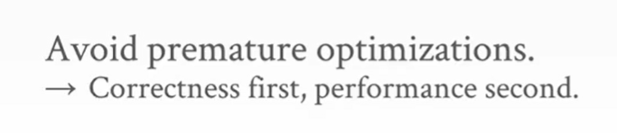
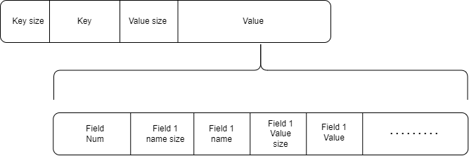
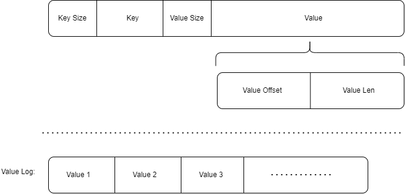
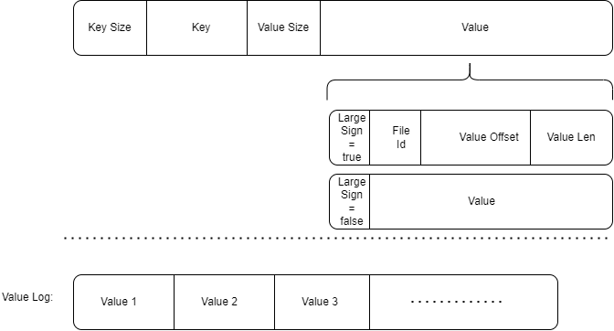
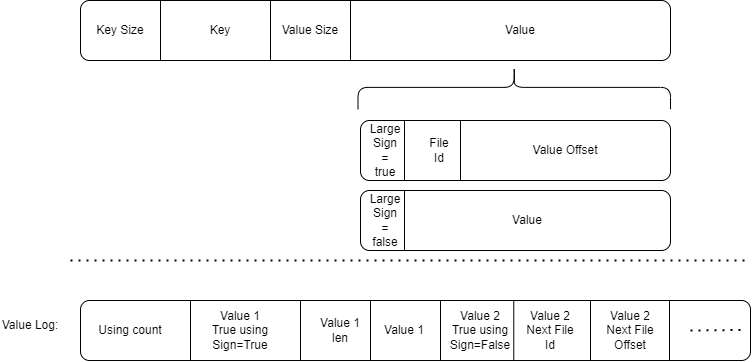
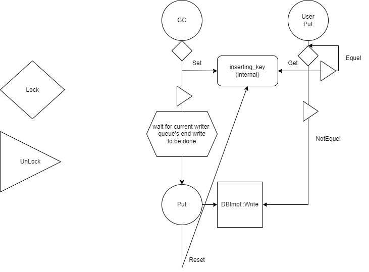
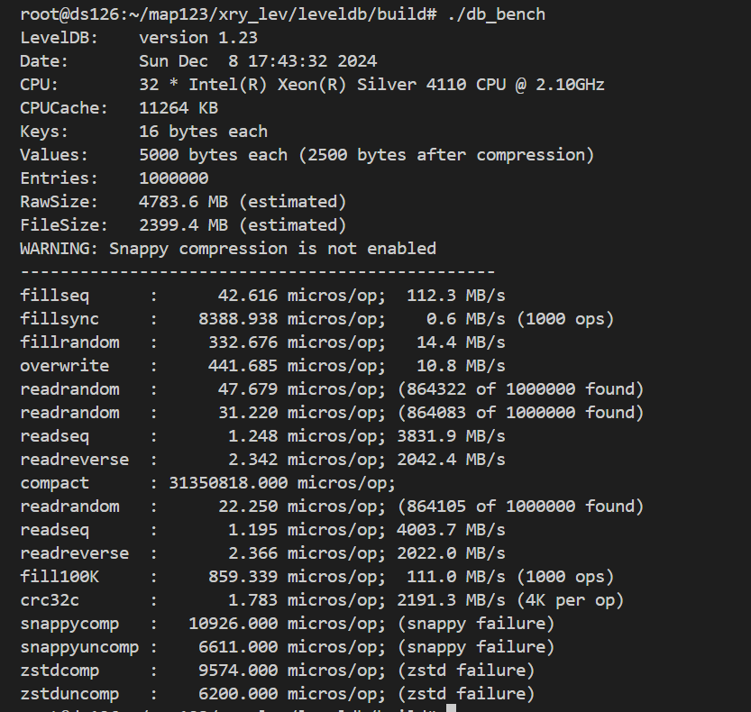
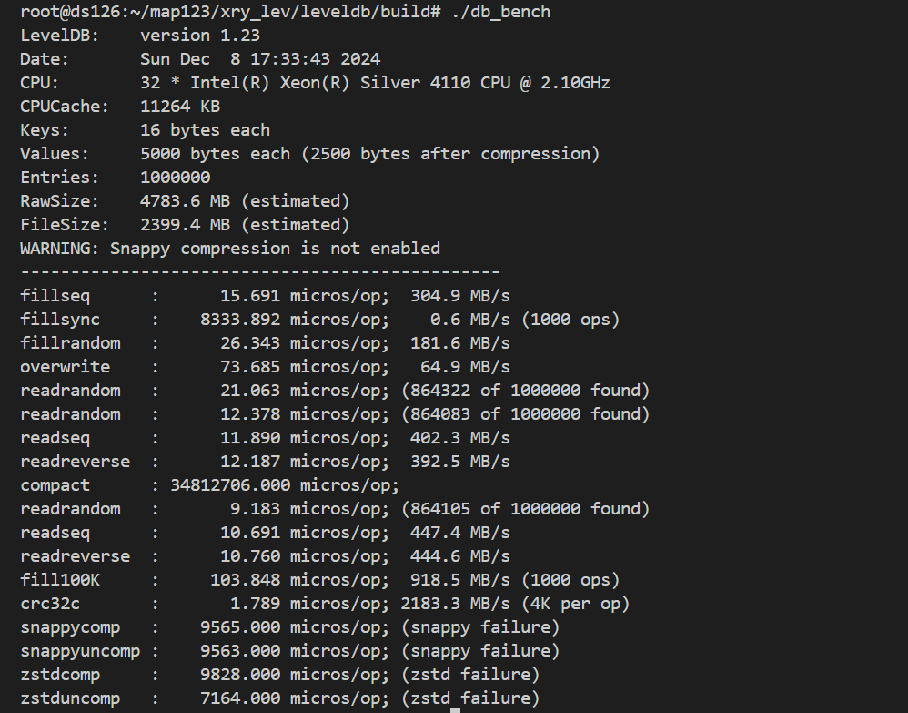
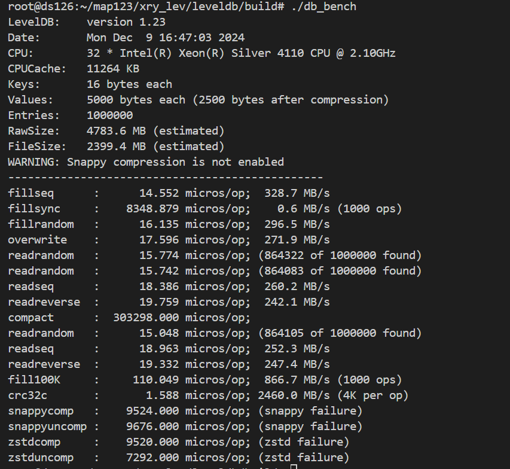

# 代码设计

## 1.项目概述

### 1.1 实现字段查询功能

LevelDB 的基本数据结构是由一个 key 和对应的 value 组成，其中 value 是一个简单的字节序列（可以是字符串或二进制数据）。默认情况下，LevelDB 不支持像关系型数据库那样的字段查询功能。然而，在实际应用中，用户可能需要对存储的数据进行更加精细的操作，特别是当值包含多个逻辑字段时，直接使用现有的 LevelDB 接口难以满足需求。
在本实验中，我们的目标是扩展 LevelDB 的功能，使其 value 支持多字段结构，并实现通过字段值查询对应的 key 的功能。

### 1.2 KV 分离

在 LevelDB 及其采用的 LSM 树结构中，性能挑战之一在于 Compaction 操作的效率。Compaction 是指将内存中的数据合并到磁盘上的过程，此过程中涉及大量的读写操作，对于系统的整体性能有着重要影响。在 Compaction 时，所有涉及到的旧 sstable 中的键值对都将被写入到新 sstable 中，而 Value 通常比 Key 大得多。如果将 Key 和 Value 分离存储，合并时只涉及 key 写入 sstable 的过程，可以显著减少 Compaction 的开销，从而提升性能。
基于此我们计划实施键值分离策略。具体而言，键将保持原有的排序方式，而值将被独立存储。这样做可以在不影响查询性能的前提下，大幅降低 Compaction 过程中的数据迁移量，进而减少不必要的磁盘 I/O ，提升系统的合并效率。


## 2.功能设计

Andy Pavlo在15445课程中说，完成一个项目，应先写出能够完成正确性要求的代码，再在此基础上提升性能，避免不成熟的优化方式。

因此，我们的项目流程将保持每周推进代码进度，在完成目标要求的代码的基础上，不断迭代优化性能。



### 2.1.字段设计

- **设计目标**：
  - 将 LevelDB 中的 `value` 组织成字段数组，每个数组元素对应一个字段（字段名：字段值）。
  - 字段会被序列化为字符串，然后插入LevelDB。
  - 这些字段可以通过解析字符串得到，字段名与字段值都是字符串类型。
  - 允许任意调整字段。
  - 实现通过字段值查询对应的 `key`。
- **实现思路**：

函数 `Put_with_fields` 负责插入含字段的数据。原字段数据经过序列化函数 `SerializeValue` 处理后，函数 `Put_with_fields` 调用 `Put` 将序列化后的字段插入 leveldb。

函数 `Get_with_fields` 负责获得含字段的数据。使用 `Get` 从 leveldb 中获取 `key` 和序列化后的 `value`，调用 `ParseValue` 可以将字段反序列化。

函数 `Get_keys_by_field` 使用iterator遍历数据库中的所有键值对，解析每个 `Value`，提取字段数组 `FieldArray`。检查字段数组中是否存在目标字段，如果匹配，则记录其对应的 `Key`。将所有匹配 `key` 汇总到 `keys` 中返回。

**初步实现**（第一周 已完成）：在 leveldb 内部实现以上功能。内部实现会导致读取时无法区分多字段类型和原生 kv 对，扩展性不足。

**后续改进_1**（第二周 已完成）：为了解决无法区分多字段类型和原生 kv 对的问题，将以上函数功能实现在用户层级，使 leveldb 内部对多字段类型无感知。

**后续改进_2**（第三周 已完成）：在完成其余功能过程中，发现leveldb在coding类中有一些编码实现，因此也做了将字段设计放入coding类实现的版本。


### 2.2.KV分离

#### 设计思路

- **KV 分离设计**

  a. 将LevelDB的key-value存储结构进行扩展，分离存储key和value。（当Value长度不大时不进行分离）

  b. 将Key和指向Value的元数据存储在LSM-tree中。

  c.将Value和其余需要额外存储在ValueLog的元数据存储于ValueLog文件。通过LSM-tree中的元数据可查询到对应的Value所处的ValueLog。

- **读取操作。**

  KV分离后依然支持点查询与范围查询操作。

- **Value log的管理**

  a.通过GC操作释放Value log中的无效数据。（对于我们的不同实现版本，GC操作有所不同）

  b.GC能把旧Value log中没有失效的数据写入新的Value log，并在有必要时更新LSM-tree。

  c.GC过程不能过度阻塞用户的Put和Get操作。（过度阻塞则和原本消耗大量资源的Compaction无区别，没有得到期望的性能提升）

- **确保操作的原子性**

​       a.Write时先写ValueLog再写WAL，从而保证操作的原子性。

​	   b.对不同版本的GC实现，均需保证GC操作过程中发生dump后，恢复数据仍能保证正确性。

#### 实现思路

#### 初步实现：Single ValueLog（第一周 已完成）

使用单一Value Log简单的实现KV分离，该实现较为简单，仅需在Put/Get函数内部进行简单修改，但在大数据量场景下性能极差。

##### 优点：实现简单，合并时开销小

##### 缺点：大数据量下性能极差，不能作为最终方案。


#### 第二种实现：ValueLog per table（第二周 已完成）

对每个SSTable和MemTable建立一个Value Log。该实现相比于初步实现更加复杂，需要在合并时查询所有相关Value Log，并建立新Value Log。此外还要考虑在合并结束后将废弃的Value Log异步删除。

**Trick.为什么要在Put到MemTable时就放入Value Log而非dump至SS Table时才放入Value Log？**

原因：将写ValueLog推迟至SSTable并没有减少Put时写入磁盘的总数据量（写ValueLog：ValueLog中写Value，WAl中写Key和Value元数据；不写ValueLog：WAL中写Key和Value），优点是将两次无法并行的写文件操作变为一次写文件操作。但该方法有一个缺陷，即leveldb原生的管理数据的方式是MemTable和SSTable大小相等。而经过这样改变后，MemTable在dump成SSTable后其大小会突然减少（Value全部转移至ValueLog），导致一个SSTable中存储的数据量过少。而原本valuelog的优势（一个SSTable可以放更多键值对使得table cache命中率变高）也将不存在了。我们将两个做法都进行了实现，通过对比性能发现后者不如前者，因此选择保留前者设计。

##### 优点：随合并自动GC，无需考虑GC。

##### 缺点：合并时开销未能减小。

#### 第三种实现：Fixsize ValueLog（第三周 已完成）

**该实现参考TiTanDB实现**

使用相对固定大小的Value Log，例如每个Value Log大小约为16MB。新添加的键值对依次将值与其长度（其实还有键和键长度）存入最新Value Log，当Value Log大小满了之后就创建新Value Log。需要设计一种异步的GC方法，该方法不会对Compaction，Get或Put造成明显的延迟。

##### 优点：合并时开销小。

##### 缺点：需要设计一种优秀的异步GC方式。

## 3. 数据结构设计

### KV分离后 Value 结构设计

一个Value，开头是使用Varint64存储的FieldNum，表示有FieldNum个Field组成。然后是使用Varint64存储的Field X name size，表示该field的字段名长度，然后是字段名，然后是使用Varint64存储的Field X Value size，表示该field的值长度，然后是值。



### ValueLog结构设计

#### Single ValueLog设计

使用一个Value Log文件的设计中，我们只需记录Value在Value Log中对应的偏移量和Value长度即可。

Value Log中只记录Value值，无需记录元信息。



#### ValueLog per table设计

Value设计为：1字节标志位+Varint64文件ID+Varint64偏移量+Varint64长度。

在存储时根据Value大小是否较大选择进行KV分离。若分离则标志位为true，否则标志位为false。

日志文件中仍然只需记录Value值即可，无需记录元信息。



#### Fixsize ValueLog设计（第一版，有漏洞）




这一版设计有些复杂，但存在漏洞。我们的最终设计并非如此。

在Value开头使用一字节标志位表示是否KV分离。

如果KV分离，则接下来是Varint64的文件ID和Varint64的文件内offset。

在ValueLog中，在开头记录当前会索引到该Value Log的键值对数量Using count。如果Using count==0，则表示该ValueLog不被任何键值对使用，可以删除。

**Using count在Value Log添加键值对时进行+1**。

**Using count**在**其中任意键值对被合并**，**并且 该键值对由于合并时被更加新的键值对覆盖 或者 该键值对的True using Sign=False**时，进行**-1**。

在一个Value通过SSTable索引到Value Log后，其索引到的开头是一个**Value True Using Sign**。该标志位同样是一字节，标志了当前该Value是否是真正的Value。

**若标志位为True表示是真正的Value，那么标志位后是Varint64的Value长度+Value本身。**

**若标志位为False表示不是真正的Value，那么标志位后是Varint64的下一个可能存在有真实对应Value的Value Log文件ID和Varint64的在下一个Value Log文件中的offset。**

**Value True Using Sign发生变化有两种情况：**

**1**

一个键值对由于合并时被更加新的键值对覆盖时，不仅将Using count进行-1，同时也将其Value True Using Sign设置为False。

**2**

在键值对加入到Value Log时，其Value True Using Sign设置为True。

当后台异步GC过程检测到一个Value Log的Using count较小时，将对其中Value True Using Sign仍为True的Value做以下处理：


1.将Value对应的数据（设为True的标志位，Value len和Value本身）像新数据一样写入最新的Value Log中。

2.将原Value True Using Sign置为False

3.将原Value Log中标志位后的数据修改为新写入的Value Log的ID和数据所处的Offset。

（保证原Value大小大于16，以防Varint64(Value len)+Value len<Varint64(File ID)+Varint64(Offset)。)

**注意**

在SSTable合并时要检查所合并的Value直接指向的Value Log是否Value True Using Sign=True，不是的话，要不断通过Next File找下一个文件，直到找到Value True Using Sign=True的文件。然后将新SSTable中的Value指向该新文件。**除此之外，在此过程中找到的所有文件的Using count都要-1**。

这样的GC设计可以确保，GC过程中无需修改原SSTable数据，且合并过程中仅需修改较少的数据。

> [!CAUTION]
>
> **！注意！在实现过程中发现性能缺陷**

当合并时由于需要扫描合并的SSTable，要对其中每个Value做读ValueLog操作（因为可能可以更新Value指向的ValueLog），导致一次合并会涉及很多次的ValueLog文件读写，性能过于低效，因此想到了新的操作方法。


#### fixsize_valuelog实际设计


####  新的`valuelog` 文件的组织方式：

`valuelog` 文件存储了 **键值对（KV）** 数据，每条记录按照以下格式组织：

1. **键的长度**（`key_len`）：`uint64_t`，标识键的字节长度。
2. **键**（`key`）：实际的键数据，长度为 `key_len`。
3. **值的长度**（`value_len`）：`uint64_t`，标识值的字节长度。
4. **值**（`value`）：实际的值数据，长度为 `value_len`。

在sstable中key对应的value位置存储了对应valuelog文件的id和在文件中的offset。

**注1：在valueLog中重复存key会导致写方法，但是是有必要的，详见GC过程**

**注2：将Key放在Value后是一个潜在的优化，可以加速Get**

#### gc过程：

垃圾回收的核心思想是扫描所有非最新的 `valuelog` 文件（最新的ValueLog还会被插入新的数据，因此不对其进行垃圾回收），检查文件中的记录是否有效。如果记录的键值对已失效（比如键在 `sstable` 中不存在或元数据不匹配），则该记录会被忽略；如果记录的键值对是该键对应最新的键值对，则将该键值对重新Put进MemTable。在对整个旧的`ValueLog`做完上述操作后删除整个旧的的 `valuelog` 文件。

#### 详细过程

1. **扫描数据库目录**：
- 遍历 `valuelog` 文件。
2. **处理每个 `valuelog` 文件**：

   - 打开文件，逐条读取记录。
3. **读取每条记录**：
   - 按文件结构读取 `key_len`、`key`、`value_len`、`value`。
   - 检查 sstable是否包含该键：
     - 如果键不存在，忽略此条记录。
     - 如果键存在，验证元数据是否有效（包括 `valuelog_id` 和 `offset`）。
   - 有效的键值对会被重新 put 进入数据库（在此操作中自然的被插入到最新的ValueLog中），SSTable中无效的键值对则会在compaction过程中被自然的回收。 
4. **清理无效文件**：
- 对ValueLog扫描完毕后，删除该ValueLog。

#### 验证元数据/重新Put的正确性保证

在发现当前键值对有效后会将该键值对重新调用Put插入数据库，然而在此过程中如果有用户新插入了对应的Key的键值对，则有概率覆盖用户插入的键值对，这是错误的。因此我们要保证在此过程中不会新插入新的该Key对应的键值对。

我们使用了三个新的操作来实现该操作：  

1.一个新的全局互斥锁GC_mutex

2.一个新的全局变量inserting_key，使用GC_mutex管理的conditional variable进行访问保护

3.更改write逻辑，可以访问当前writer队列的末尾write请求，并在其做完时获得其对应的conditional variable的提醒

下图是实现整个操作的模拟，左侧是图标，Lock和UnLock都指对GC_mutex的操作



## 4. 接口/函数设计

#### 4. 1Value多字段设计

##### **4.1.1 数据序列化与反序列化**

**序列化字段数组为字符串值**

```cpp
std::string SerializeValue(const FieldArray& fields);
```

- **输入**：字段数组 `fields`。

- **输出**：序列化后的字符串。

  

**反序列化字符串值为字段数组**

```c++
void DeserializeValue(const std::string& value_str, FieldArray* res);
```

- **输入**：序列化字符串 `value_str`。
- **输出**：字段数组 `res`。


##### **4.1.2 数据查询接口**

**按字段查找键**

```c++
Status DB::Get_keys_by_field(const ReadOptions& options, const Field field, std::vector<std::string>* keys);
```

- **输入**：
  - 读取选项 `options`。
  - 字段值 `field`。
- **输出**：
  - 操作状态 `Status`。
  - 符合条件的键列表 `keys`。


##### **4.1.3 判断文件是否为 `valuelog` 文件**

**判断给定文件是否为 `.valuelog` 格式的文件。**

```c++
bool IsValueLogFile(const std::string& filename) ;
```

**输入**：

- 文件名 `filename`，可以是完整路径或纯文件名。

**输出**：

- 布尔值 `true`：文件是 `valuelog` 文件。
- 布尔值 `false`：文件不是 `valuelog` 文件。


##### **4.1.4 解析 `sstable` 中的Value元信息(用于Fixsize ValueLog)**

**解析 `sstable` 中存储的值，提取 `valuelog_id` 和 `offset` 信息。**

```c++
void ParseStoredValue(const std::string& stored_value, uint64_t& valuelog_id, uint64_t& offset);
```

- **输入**：
  - 存储值 `stored_value`，格式为 `"valuelog_id|offset"`。
- **输出**：
  - `valuelog_id`：解析出的 ValueLog 文件 ID。
  - `offset`：解析出的记录偏移量。


##### **4.1.5 获取 `ValueLog` 文件 ID**

**从文件名中提取 ValueLog 文件的 ID（假设文件名格式为 `number.valuelog`）。**

```
uint64_t GetValueLogID(const std::string& valuelog_name);
```

- **输入**：
  - 文件名 `valuelog_name`，可以是完整路径或仅文件名，格式需符合 `number.valuelog`。
- **输出**：
  - `uint64_t` 类型，返回提取的文件 ID。


#### 4.2 Value Log设计

##### **4.2.1 WriteValueLog**

将一堆键值对的值顺序写入Value Log，用于writebatch写入数据库，以及Value Log GC的时候（valuelog per table）。两者都会对多个键值对同时操作，因此设计为批处理。

该函数被mutex_保护，保证不会多线程调用。

```cpp
std::vector<std::pair<uint64_t,uint64_t>> WriteValueLog(std::vector<const slice&> value);
```

- **输入**：一个Slice vector，表示要写入Value Log的Value们。

- **输出**：一个std::pair<uint64_t,uint64_t> vector，每个pair中：第一个uint64_t是Value Log文件ID，第二个uint64_t是处在Value Log中的偏移量。

> [!NOTE]
>
> 在第三版设计中，valuelog中会存储key，所以还需要传入key


##### **4.2.2 ReadValueLog**

通过Value Log读取目标键值对的值。

```cpp
Status ReadValueLog(uint64_t file_id, uint64_t offset,Slice* value);
```

- **输入**：第一个uint64_t是Value Log文件ID，第二个uint64_t是处在Value Log中的偏移量，第三个是指向要传回的value的指针。
- **输出**：一个Status，表示是否成功传回对应Value。

> [!NOTE]
>
> 在第三版设计中，valuelog中会存储key，所以还会多一个返回参数Key

##### **4.2.3  测试GC**

调用`MaybeScheduleGarbageCollect()`来安排一个后台线程执行垃圾回收任务。它会等待所有已安排的垃圾回收任务完成，这通过循环检查`background_garbage_collect_scheduled_`标志，并在该标志为真时等待`background_gc_finished_signal_`信号来实现。

```cpp
void DBImpl::manual_GarbageCollect()
```


##### **4.2.4  调用线程进行GC**

启动一个新的后台线程执行`BGWorkGC`方法。使用互斥锁gc_mutex_确保同时最多只有一个GC后台线程会进行。

```cpp
void DBImpl::MaybeScheduleGarbageCollect()
```


##### **4.2.5  调用负责GC函数**

调用`BackgroundGarbageCollect()`进行实际的垃圾回收工作。

```cpp
void DBImpl::BGWorkGC(void* db)
```


##### **4.2.6  后台GC函数**

负责执行后台垃圾回收任务（即调用GarbageCollect）。确保在完成任务后通知等待的线程。

(当前等待的函数仅两个：Test与DBImpl的析构函数)

```cpp
void DBImpl::BackgroundGarbageCollect()
```


##### **4.2.7  后台GC函数**

垃圾回收的核心实现。在目前的设计下，它遍历数据库目录中的所有valuelog文件，并尝试回收不再需要的数据。

```cpp
void DBImpl::GarbageCollect() 
```


##### 4.2.8 改动TableMeta（用于valuelog per table）

对TableMeta新增一个uint64_t的属性valuelog_id，表示该SSTable所对应的valuelog id。如果该SSTable内所有Value长度均小于ValueLog要求长度，则该属性值为0。

这个设计对versionEdit以及compact的各个函数均有影响。


##### 4.2.9 class ValueLogInserter : public WriteBatch::Handler{}

用于将一个WriteBatch里的所有键值对插入到ValueLog里，并生成将Value指向ValueLog的新WriteBatch。


##### 4.2.10 Status WriteBatchInternal::ConverToValueLog(WriteBatch* b,DB* db_)

使用ValueLogInserter将b中的键值对更新至ValueLog，并将更新后的WriteBatch放回b。

该函数用于Write中的队首线程build batch后且写WAL日志/写Memtable前。


------


## 5. 功能测试

### 5.1**单元测试（测试用例）**：

#### 依据我们的设计，每周的工作内容完成后，都将对当前完成的功能进行正确性检验。以下以第一周我们完成的功能为例：

#### 第一周（已完成）

**字段数组的存储与读取：**

验证了 `Put_with_fields` 和 `Get_with_fields` 的正确性，确保字段数组可以正确序列化存储并反序列化读取。

**基于字段的键查询：**

验证了 `Get_keys_by_field` 的逻辑，确保能够根据字段值查找所有匹配的键。

**Key Value分离：**

并未额外设计，通过上两个功能的正确运行能够证明Key Value分离的初步实现大体是正确的。


#### 第二、三周（已完成）

**对多字段Value实现更严谨的测试**

针对范围查询进行更严格的测试（因为范围查询难于单点查询），进行了乱序插入后测试范围查询能否查询到分布在lsm-tree各处且key完全随机的目标value。

```
std::vector<std::string> keys;
    std::vector<std::string> target_keys;
    for(int i=0;i<10000;i++){
      std::string key=std::to_string(rand()%10000)+"_"+std::to_string(i);//random for generate nonincreasing keys
      FieldArray fields={
        {"name", key},
        {"address", std::to_string(rand()%7)}, 
        {"phone", std::to_string(rand()%114514)}
      };
      if(rand()%5==0){
        fields[0].second="special_key";
        target_keys.push_back(key);
      }
      keys.push_back(key);
      db->Put(WriteOptions(),key,SerializeValue(fields));
    }
    std::sort(target_keys.begin(),target_keys.end());
    std::vector<std::string> key_res;
    Get_keys_by_field(db,ReadOptions(),{"name", "special_key"},&key_res);
    ASSERT_TRUE(CompareKey(key_res, target_keys));
```

2.向表内插入大量value较大的键值对后检验正确性（该测试被leveldb原benchmark完美取代。使用leveldb原benchmark获得了正确性保障）

对于for(int j=0;j<5000;j++)这一段，我们也尝试过将5000改成rand()%1000，同样通过了测试。

```
std::vector<std::string> values;
    for(int i=0;i<500000;i++){
        std::string key=std::to_string(i);
        std::string value;
        for(int j=0;j<5000;j++){
            value+=std::to_string(i);
        }
        values.push_back(value);
        db->Put(writeOptions,key,value);
    }
    for(int i=0;i<500000;i++){
        std::string key=std::to_string(i);
        std::string value;
        Status s=db->Get(readOptions,key,&value);
        assert(s.ok());
        if(values[i]!=value){
            std::cout<<value.size()<<std::endl;
            assert(0);
        }
        ASSERT_TRUE(values[i]==value);
    }
```

3.对GC进行正确性检测：在关闭自动GC的情况下，进行一次手动GC，然后查询所有键值对，期望仍能够读到。

```
std::vector<std::string> values;
    for(int i=0;i<5000;i++){
        std::string key=std::to_string(i);
        std::string value;
        for(int j=0;j<1000;j++){
            value+=std::to_string(i);
        }
        values.push_back(value);
        db->Put(writeOptions,key,value);
    }
    std::cout<<"start gc"<<std::endl;
    db->manual_GarbageCollect();
    std::cout<<"finish gc"<<std::endl;

    for(int i=0;i<5000;i++){
        // std::cout<<i<<std::endl;
        std::string key=std::to_string(i);
        std::string value;
        Status s=db->Get(readOptions,key,&value);
        assert(s.ok());
        if(values[i]!=value){
            std::cout<<value.size()<<std::endl;
            assert(0);
        }
        ASSERT_TRUE(values[i]==value);
    }
```


### 5.2**性能测试（Benchmark）**：

这一部分我们希望在完成大部分功能后再根据代码调整。

在第三周我们在服务器上运行了leveldb原生代码、version_2以及version_3，得到以下结果。


原leveldb：



version_2:



version_3:



## 6. 可能遇到的挑战与解决方案

如何处理**GC开销、数据同步**

**如何实现GC**

在数据结构设计中已经进行了详细说明。

第二种设计通过合并过程自动完成了GC的功能。

第三种设计通过设计了一种异步的GC操作，使GC无需改变SSTable数据。

**数据同步**

写Value Log的时机和写WAL的时机一致，都在写MemTable之前完成。如果用户的Sync参数设置为True，则要保证Value Log一定写入完成后才能返回给用户写入成功的信息。

**减少GC开销**

实现了一些较细的优化点，例如：在GC时先不从valuelog读Value，而是先确认该键值对是否有效，如果无效则无需读出Value（Value较长，读取耗费时间与IO资源）


## 7. 分工和进度安排

| 功能                                       | 完成日期 | 分工          |
| ------------------------------------------ | -------- | ------------- |
| 完成初步的多字段Value实现和KV分离实现      | 11月20日 | 谢瑞阳        |
| 完成设计文档                               | 11月27日 | 徐翔宇&谢瑞阳 |
| 将多字段Value实现迁移至用户层级            | 11月27日 | 徐翔宇        |
| 完成第二版ValueLog                         | 11月28日 | 徐翔宇&谢瑞阳 |
| 完成第二版ValueLog的测试                   | 11月28日 | 徐翔宇&谢瑞阳 |
| 完成第三版ValueLog                         | 12月4日  | 徐翔宇&谢瑞阳 |
| 完成第三版ValueLog的测试                   | 12月4日  | 徐翔宇&谢瑞阳 |
| 完成BenchMark，对不同KV分离方案进行测试    | 12月8日  | 徐翔宇&谢瑞阳 |
| 学习TiTanDB的代码，学习优化方法            | 12月13日 | 徐翔宇&谢瑞阳 |
| 明确接下来要做的优化点顺序，进行迭代与优化 | 12月22日 | 徐翔宇&谢瑞阳 |
| 完成BenchMark设计                          | 12月22日 | 徐翔宇&谢瑞阳 |


## 8. 每周进度更新

12.3-12.9：实现version_2，修改version_3设计，完成version_3，benchmark实验。


- [ ] 在valuelog中调整value和key的顺序，kv_len的储存形式，get的时机应该在读取value之前
- [ ] 调整kv分离标志位的位置
- [ ] 实现valuelog的block_cache
- [ ] 对范围查询做ValueLog预取优化
- [ ] 对valueLog做压缩优化(?)
- [ ] 实现key-only scan（便利用户，一些场景无需找value）
- [ ] 实现YCSB benchmark测试
- [ ] 使用内存表或者元数据表做valueLog空洞率记录
- [ ] 需要延迟删除valueLog，做法待商榷

