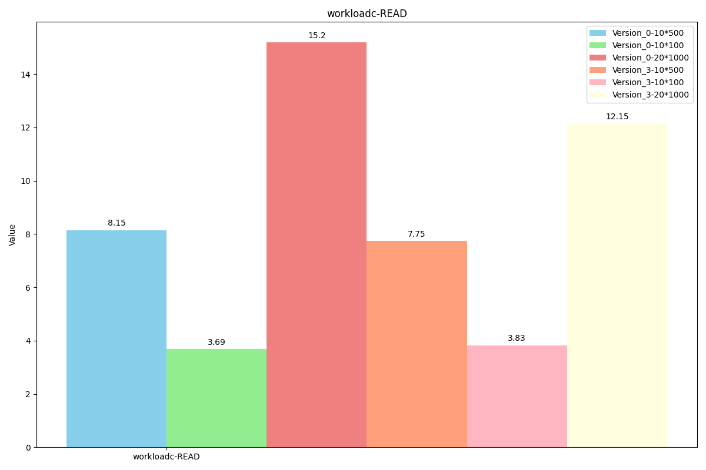
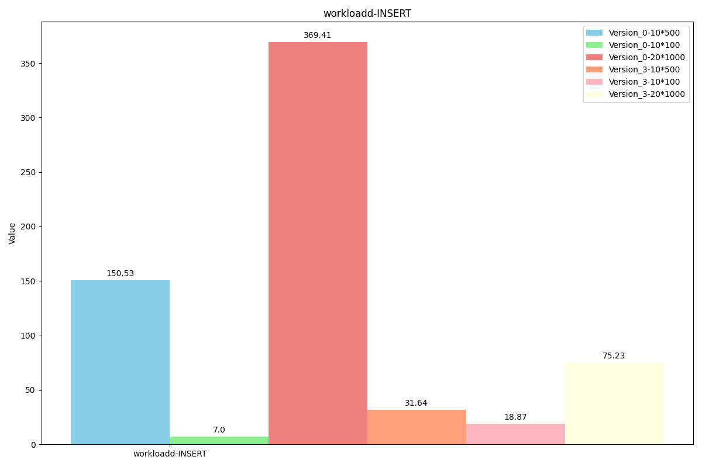
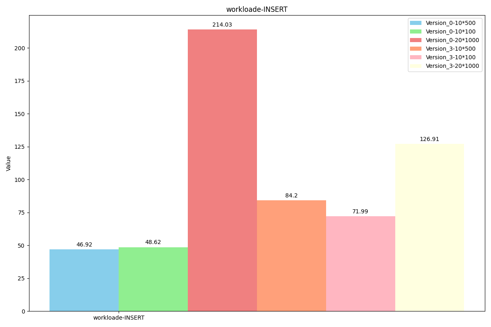

# XOY-LEVELDB-KV-Seperation

## 0.安装流程

#### 1.下载代码及子仓库

```sh
git clone https://gitea.shuishan.net.cn/10225101483/XOY-leveldb-exp2.git
git submodule update --init
```

#### 编译代码

```sh
mkdir -p build && cd build
cmake -DCMAKE_BUILD_TYPE=Release .. && cmake --build .
```

#### 正确性测试

```sh
cd build
./levedb_tests  #leveldb原生测试
./valuelogTest  #新加测试
```

#### Levedb-BenchMark性能测试

```sh
cd build
./db_bench
```

#### YCSB-BenchMark性能测试

```sh
cd build
sudo make install
cd ..
cd YCSB-cpp
git submodule update --init
bash run_my_leveldb.sh
```

在`run_my_leveldb.sh`脚本内修改workload名称，以测试不同workload下的性能表现。

##### git贡献者对应关系

alexfisher，小人鱼：谢瑞阳
xxy：徐翔宇
dgy：（使用实验室服务器测试更改代码提交时使用的git账号）：徐翔宇+谢瑞阳共同使用

## 1.项目概述

### 1.1 多字段扩展

LevelDB 的基本数据结构是由一个 key 和对应的 value 组成，其中 value 是一个简单的字节序列（可以是字符串或二进制数据）。默认情况下，LevelDB 不支持像关系型数据库那样的字段查询功能。然而，在实际应用中，用户可能需要对存储的数据进行更加精细的操作，特别是当值包含多个逻辑字段时，直接使用现有的 LevelDB 接口难以满足需求。

我们扩展了 LevelDB 的功能，为用户提供了将多字段元组序列化为单个字符串功能，以及对应的反序列化功能，并支持通过字段与对应值查询满足条件的 keys 的功能。

### 1.2 KV 分离

在 LevelDB 及其采用的 LSM 树结构中，性能挑战之一在于 Compaction 操作的效率。Compaction 是指将内存中的数据合并到磁盘上的过程，此过程中涉及大量的读写操作，对于系统的整体性能有着重要影响。在 Compaction 时，所有涉及到的旧 sstable 中的键值对都将被写入到新 sstable 中，而 Value 通常比 Key 大得多。如果将 Key 和 Value 分离存储，合并时只涉及 key 写入 sstable 的过程，可以显著减少 Compaction 的频率与开销，从而提升性能。

基于此我们计划实施键值分离策略。具体而言，键将保持原有的排序方式，而值将被独立存储在 ValueLog 。这样做可以在不影响查询性能的前提下，大幅降低 Compaction 过程中的数据迁移量，进而减少不必要的磁盘 I/O ，提升系统的合并效率。


### 1.3 KV 分离范围查询性能优化

传统KV分离方法将对用户的范围查询性能产生大幅度的性能下降，因为原本对于多个 SSTable 的顺序访问将变为对大量 ValueLog 文件的随机访问。

基于此，我们设计了一种新的无序范围查询方式，使得在保留有大部分KV分离带来的读-写优势的情况下，范围查询的性能仍然有较好的表现。


## 2.设计思路

### 2.1.字段设计

- **设计目标**：
  
  - 提供给用户将多个字段序列化为单个字符串以及反序列化的功能。
  - 将功能以扩展的方式嵌入LevelDB项目中，尽量保证项目结构优雅。
  - 实现通过字段值查询对应的 `key`的功能。
  
- **实现思路**：
- 多个字段可以抽象为：vector<pair<string,string>>。
  
- 以一种可以包含所有字段总长度以及每个字段各自的长度以及数据的方式对其进行序列化与反序列化。

函数 `SerializeValue` 负责将`vector<pair<string,string>>`形式的字段数组序列化为单个字符串。

函数 `DeserializeValue` 负责反序列化含字段的数据。如果反序列化失败则返回异常Status。

函数 `Get_keys_by_field` 使用iterator遍历数据库中的所有键值对，使用`DeserializeValue`解析每个 `Value`，如果成功提取字段数组 `FieldArray`则检查字段数组中是否存在目标字段，如果匹配，则记录其对应的 `Key`。将所有匹配 `key` 汇总到 `keys` 中返回。


### 2.2.KV分离

#### 设计思路

- **KV 分离设计**

  - 将LevelDB的key-value存储结构进行扩展，分离存储key和value。（当Value长度不大时不进行分离）

  - 将Key和Value的元数据存储在LSM-tree中。

  - 将Value和其余需要额外存储在ValueLog的元数据存储于ValueLog文件。通过LSM-tree中Value的元数据可查询到对应的Value所处的ValueLog。

- **读取操作。**

  - 实现KV分离后仍支持原先点查询与范围查询操作。
  - 实现额外的无序范围查询以减少由于KV分离所导致的范围查询性能损失。

- **Value log的管理**

  - 数据在进入MemTable与Wal日志前先进入ValueLog。
  - 用户可以在Options中启用ValueLog CRC选项，使ValueLog文件遭到损坏时数据库仍能正常运行。
  - 通过GC操作释放Value log中的无效数据。GC能将旧Value log中没有失效的数据写入新的Value log，并更新LSM-tree。
  - GC过程不能过度阻塞用户的Put和Get操作。（过度阻塞则和原本消耗大量资源的Compaction无区别，没有得到期望的性能提升）
  - GC操作仅对无效数据达到一定量级的ValueLog进行。
  - 使用常驻内存的ValueLog元数据表来维护ValueLog中有效数据占比的信息。

- **操作正确性**

  - Write时先写ValueLog再写WAL，从而保证操作的原子性。
  - GC操作需使用某种算法设计来保证GC操作与其他Put操作和Get操作并发的正确性。

#### 初步实现：Single ValueLog

使用单一Value Log简单的实现KV分离，该实现较为简单，仅需在Put/Get函数内部进行简单修改，但在大数据量场景下性能极差。

##### 优点：实现简单，合并时开销小

##### 缺点：大数据量下性能极差，不能作为最终方案。


#### 优化实现：ValueLog per table

对每个SSTable和MemTable建立一个Value Log。该实现相比于初步实现更加复杂，需要在合并时查询所有相关Value Log，并建立新Value Log。此外还要考虑在合并结束后将废弃的Value Log异步删除。

**Trick.为什么要在Put到MemTable时就放入Value Log而非dump至SS Table时才放入Value Log？**

原因：将写ValueLog推迟至SSTable并没有减少Put时写入磁盘的总数据量（写ValueLog：ValueLog中写Value，WAl中写Key和Value元数据；不写ValueLog：WAL中写Key和Value），优点是将两次无法并行的写文件操作变为一次写文件操作。但该方法有一个缺陷，即leveldb原生的管理数据的方式是MemTable和SSTable大小相等。而经过这样改变后，MemTable在dump成SSTable后其大小会突然减少（Value全部转移至ValueLog），导致一个SSTable中存储的数据量过少。而原本valuelog的优势（一个SSTable可以放更多键值对使得table cache命中率变高）也将不存在了。我们将两个做法都进行了实现，通过对比性能发现后者不如前者，因此选择保留前者设计。

##### 优点：随合并自动GC，无需考虑GC。

##### 缺点：合并时开销未能减小。


#### 最终实现：Fixsize ValueLog

**该实现参考TiTanDB实现**

使用相对固定大小的Value Log，默认每个Value Log大小约为64MB。新添加的键值对依次将值与其长度（其实还有键和键长度）存入最新Value Log，当Value Log大小满了之后就创建新Value Log。需要设计一种异步的GC方法，该方法不会对Compaction，Get或Put造成明显的延迟。

##### 优点：合并时开销小。

##### 缺点：需要使用异步GC对ValueLog进行垃圾回收，会造成一定的写放大。

## 3. 实现设计

### 序列化 Value 结构设计

开头是使用Varint64存储的FieldNum，表示有FieldNum个Field组成。然后是使用Varint64存储的Field X name size，表示该field的字段名长度，然后是字段名，然后是使用Varint64存储的Field X Value size，表示该field的值长度，然后是值。


### ValueLog结构设计

#### Single ValueLog设计

使用一个Value Log文件的设计中，我们只需记录Value在Value Log中对应的偏移量和Value长度即可。

Value Log中只记录Value值，无需记录元信息。


#### ValueLog per table设计

Value设计为：1字节标志位+Varint64文件ID+Varint64偏移量+Varint64长度。

在存储时根据Value大小是否较大选择进行KV分离。若分离则标志位为true，否则标志位为false。

日志文件中仍然只需记录Value值即可，无需记录元信息。


#### Fixsize ValueLog设计（第一版，有漏洞）


这一版设计有些复杂，但存在漏洞。我们的最终设计并非如此。

在Value开头使用一字节标志位表示是否KV分离。

如果KV分离，则接下来是Varint64的文件ID和Varint64的文件内offset。

在ValueLog中，在开头记录当前会索引到该Value Log的键值对数量Using count。如果Using count==0，则表示该ValueLog不被任何键值对使用，可以删除。

**Using count在Value Log添加键值对时进行+1**。

**Using count**在**其中任意键值对被合并**，**并且 该键值对由于合并时被更加新的键值对覆盖 或者 该键值对的True using Sign=False**时，进行**-1**。

在一个Value通过SSTable索引到Value Log后，其索引到的开头是一个**Value True Using Sign**。该标志位同样是一字节，标志了当前该Value是否是真正的Value。

**若标志位为True表示是真正的Value，那么标志位后是Varint64的Value长度+Value本身。**

**若标志位为False表示不是真正的Value，那么标志位后是Varint64的下一个可能存在有真实对应Value的Value Log文件ID和Varint64的在下一个Value Log文件中的offset。**

**Value True Using Sign发生变化有两种情况：**

**1**

一个键值对由于合并时被更加新的键值对覆盖时，不仅将Using count进行-1，同时也将其Value True Using Sign设置为False。

**2**

在键值对加入到Value Log时，其Value True Using Sign设置为True。

当后台异步GC过程检测到一个Value Log的Using count较小时，将对其中Value True Using Sign仍为True的Value做以下处理：


1.将Value对应的数据（设为True的标志位，Value len和Value本身）像新数据一样写入最新的Value Log中。

2.将原Value True Using Sign置为False

3.将原Value Log中标志位后的数据修改为新写入的Value Log的ID和数据所处的Offset。

（保证原Value大小大于16，以防Varint64(Value len)+Value len<Varint64(File ID)+Varint64(Offset)。)

**注意**

在SSTable合并时要检查所合并的Value直接指向的Value Log是否Value True Using Sign=True，不是的话，要不断通过Next File找下一个文件，直到找到Value True Using Sign=True的文件。然后将新SSTable中的Value指向该新文件。**除此之外，在此过程中找到的所有文件的Using count都要-1**。

这样的GC设计可以确保，GC过程中无需修改原SSTable数据，且合并过程中仅需修改较少的数据。

> [!CAUTION]
>
> **！注意！在实现过程中发现性能缺陷**

当合并时由于需要扫描合并的SSTable，要对其中每个Value做读ValueLog操作（因为可能可以更新Value指向的ValueLog），导致一次合并会涉及很多次的ValueLog文件读写，性能过于低效，因此想到了新的操作方法。


#### fixsize_valuelog实际设计


####  最终`valuelog` 文件的组织方式：

`valuelog` 文件存储了 **键值对（KV）** 数据，每条记录按照以下格式组织：

1. **值的长度**（`value_len`）：`uint64_t`，标识值的字节长度。
2. **值**（`value`）：实际的值数据，长度为 `value_len`。
3. **键的长度**（`key_len`）：`uint64_t`，标识键的字节长度。
4. **键**（`key`）：实际的键数据，长度为 `key_len`。
5. **CRC校验码**：如果启用了valuelog_crc，那么在键后会加上一个uin32_t(4字节)的CRC校验码。该校验码通过对value和key进行双重哈希得到。

在sstable中key对应的value位置存储了对应valuelog文件的id和在文件中的offset。

**trick1：在valueLog中重复存key会导致写方法，但是是有必要的，详见GC过程**

**trick2：将Key放在Value后，使得不启用CRC校验码时可以无需读取key_len和key，加速read**

**trick3：CRC校验码无需校验长度，因为如果长度不对，那么解析出来的值/键/CRC校验码位置也都会出错**

**trick4：CRC校验码使用Extend进行两重哈希，因为如果要对key和value一起哈希，那么每次校验需要额外开辟一个给key和value一起使用的内存空间，往该内存空间填充数据的过程如下：文件指针获取value长度，右移，获取key长度，左移，获取value，右移，获取key；性能不如单独开空间的连续右移读取操作**

### gc过程：

垃圾回收的核心思想是扫描所有非最新的 `valuelog` 文件（最新的ValueLog还会被插入新的数据，因此不对其进行垃圾回收），检查文件中的记录是否有效。如果记录的键值对已失效（比如键在 `sstable` 中不存在或元数据不匹配），则该记录会被忽略；如果记录的键值对是该键对应最新的键值对，则将该键值对重新Put进MemTable。在对整个旧的`ValueLog`做完上述操作后删除整个旧的的 `valuelog` 文件。

#### 详细过程

1. **扫描数据库目录**：
- 遍历所有未被GC处理的`valuelog` 文件。
- 使用内存表`valuelog_origin`和`valuelog_usage`判定每个ValueLog是否空洞率达到要求。如果达到要求则进入第二步。（该操作要持有mutex_锁）
2. **依次处理所有通过第一步的 `valuelog` 文件**：
   - 打开文件，逐条读取记录。
   - 如果打开文件失败，则忽略该ValueLog。否则进入第三步。
3. **读取每条记录**：
   - 按文件结构读取 `value_len`、`value`、`key_len`、`key`。
   - 检查 sstable是否包含该键：
     - 如果键不存在，忽略此条记录。
     - 如果键存在，验证元数据是否有效（包括 `valuelog_id` 和 `offset`）。
     - 若元数据匹配不上，同样忽略此条记录。
   - 有效的键值对会被重新 put 进入数据库（在此操作中自然的被插入到最新的ValueLog中），SSTable中无效的键值对则会在compaction过程中被自然的回收。 
   - 如果一条记录异常（读文件失败，或者CRC校验失败），则跳过整个ValueLog（已经GC的部分不影响）。该ValueLog不会进入后面的**延迟删除**环节。
4. **延迟清理GC完毕的ValueLog文件**：
- 对ValueLog扫描完毕后，**延迟删除（Trick2）**该ValueLog。

#### Trick1：验证元数据/重新Put的正确性保证

在发现当前键值对有效后会将该键值对重新调用Put插入数据库，然而在此过程中如果有用户新插入了对应的Key的键值对，则有概率覆盖用户插入的键值对，这是错误的。因此我们要保证在此过程中不会新插入新的该Key对应的键值对。

我们使用了三个新的操作来实现该操作：  

1.一个新的全局变量inserting_key，使用mutex_管理的conditional variable进行访问保护

2.更改write逻辑，在即将进入writer队列前，使用`ValueLogChecker`对要插入的writebatch进行遍历，确保writebatch中不存在与inserting_key相同的key。

下图是实现整个操作的模拟，左侧是图标，Lock和UnLock都指对GC_mutex的操作


ValueLogChecker主要逻辑如下：

lock_key\_=mutex_

cond_var\_=mutex_保护的条件变量

```c++
//check if all data in the writebatch is different from the given key (the key gc is searching)
//if find a key was the same to target key, then all keys must be scaned again.
void CheckValid(){
    int len=keys.size();
    if(!len)return;
    int l=0;
    int r=len-1;
    bool locked=false;
    while(!lock_key_->empty()){
      locked=false;
      while(!lock_key_->empty()&&keys[l]==*lock_key_){
        cond_var_->Wait();
        locked=true;
      }
      if(locked){
        r=l-1;//a full round to make sure no key = current lock_key
        if(r<0)r=len-1;
      }
      else if(l==r)break;
      if(++l==len)l=0;
    }
  }
```


#### Trick2：仅针对空洞率高的ValueLog进行GC，使用内存表维护ValueLog空洞率

使用内存表`ValueLogOrigin`和`ValueLogUsage`来维护每个ValueLog中总共记录的键值对数量，以及其中有效的键值对数量。

##### 维护内存表的三个地方：

1.`writeValueLog`末尾：将本次插入的数量加入两张内存表中。

2.`doCompactionWork`抛弃重复key的旧数据时：如果它使用ValueLog，就解析出它对应的ValueLog ID，将对应的ValueLogUsage值-1。

3.`Recover`结束时：需要遍历所有恢复完成后有效的数据，将它们对应的ValueLog加入ValueLogOrigin和ValueLogUsage。这一步有些复杂，请看以下说明。


#### Trick3：延迟删除valueLog文件

在leveldb中，同一时间正在进行的多个查询可能读到不同版本的数据。因此即使我们将一整个valuelog进行GC后，指向该valueLog的kv键值对仍然可能被一个较旧的长时间查询读到。因此，我们必须确保所有指向该valueLog的键值对都已经绝对不会读到，才可对该valueLog进行删除。并且延迟删除valueLog的设计本身并不会对系统带来磁盘空间上的更多负担，因此该实现是可以进行的。

那么重要的就是该如何实现该设计。

我们的设计是：利用versionset维护的version链表，当且仅当在valueLog m GC完成时活着的所有version都死亡时（从version链表中移除，触发析构函数），才会将该valueLog删除。

**我们在全局维护一个global map（在versionset类中），该map记录了所有GC完成，有待被删除的valueLog ID和它们对应的活跃version数量。**

**我们在每个version中维护一个 valueLog set，表示该version移除时要在global map更新的valueLogID。**

**一个version的析构函数在将一个valueLog的活跃version数量降至0时，会直接将该valueLog删除。**


### 范围读取优化

#### 实现1.prefetch

实现了该方法，但效果不佳，且与valueLog cache冲突，现在不在最新的代码中。

**可以checkout旧commit来体验：9d8062e474e0a121bae0a167754cb869892ab124**

**1.在创建internal iterator时，还伴随着一个隐式的prefetch iterator的创建**

**2.在internal iterator进行seek(to first/to last/to particular key)操作后，prefetch iterator会做同样的seek，然后异步的进行next并将对value的解析交给worker线程们。worker线程将处理后的结果放入该Value对应偏移量的prefetch数组位置中。**

**3.主线程使用bool原子变量对prefetch数组进行访问，如果已经有元素，那么直接加载该元素。**

经过实验发现，我们的prefetch有一些缺陷。

**缺陷1.IO次数未减少**

通过实验发现，在benchmark中扫描性能在最后情况仅提升一倍，并且prefetch已经高度命中（92%命中prefetch）。

经过perf火焰图测试发现，大多数时间仍用于系统调用read，IO仍然是瓶颈，因此未从本质上解决问题。


**缺陷2：prefetch数组需要存放所有Value，实践中不可行**

由于以上两个缺陷，我们抛弃了Prefetch功能，转而实现了后面更高效的新方法。

#### 实现2.ValueLog Cache

- 复用leveldb的LRU cache接口。

- 在Options中增加一个memory valuelog number作为LRU链表上限。该上限可以通过计算期望的valueLog使用内存容量除以valueLog大小得到。

- 每次读valuelog时，若该valuelog非最新valuelog，则通过LRU cache来读取。（不在cache中则会插入cache）

- leveldb::RandomAccessFile在绝大多数状况使用mmap来访问文件。尝试过不使用mmap而固定使用将整个文件读入内存作为cache的方式，效果远不如mmap。

**优势**

当ValueLogCache可以容纳数据库中所有ValueLog时，性能表现很棒，Scan可以达到原LevelDB Scan性能的2/3。（原4000MB/S，现在3000MB/S，不使用ValueLogCache则400MB/S)

**劣势**

当ValueLogCache无法容纳所有ValueLog时，性能提升水平将骤降，Scan性能仅从400MB/S提升至500MB/S。

我们保留了ValueLog Cache的设计。与此同时我们提出了一种新的Scan方式，使用这种新的Scan方式将解决以上遇到的大部分问题。

#### 实现3.Unordered Iterator

**观察：**许多使用NoSQL scan功能的场景并不需求Iterator返回数据的有序性。并且使用Iterator时并不会用Prev和Next反复横跳，而是单向遍历。

基于观察，我们提出了Unordered Iterator。即与原Iterator功能相同但不保证返回数据有序性的Iterator。

该Iterator有以下特点：

**1.性能比普通Iterator提升约3~4倍**

**2.相比于ValueLog Cache内存需求大大减小，一般32MB即可满足需求**

**3.不支持Prev，Seek，SeekToFirst, SeekToLast功能。在创建Iterator时需要给定Key的上下界lowerbound，upperbound**

#### 工作流程

过程有些复杂，只能上代码了。

注：mode==0表示在使用iter遍历阶段

mode==1表示遍历valuelog_map阶段

mode==2表示读完所有数据，InValid了。

```
void UnorderedIter::Next() {
  if(mode==0){
    if(iter_->Valid()&&!keyGreaterThanRequire())
    {
      if(first_one){
        first_one=false;
      }
      else iter_->Next();
      for(;
          iter_->Valid()&&memory_usage<max_unorder_iter_memory_usage_&&!keyGreaterThanRequire();
          memory_usage+=2*sizeof(uint64_t),iter_->Next())
      {
        if(checkLongValue(iter_->value())){
          auto pr=GetAndParseValue(iter_->value());
          valuelog_map[pr.first].push_back(pr.second);
        }
        else{
          now_key=iter_->key();
          now_value=iter_->value();
          now_value.remove_prefix(1);
          return;
        }
      }
    }
    
    valuelog_map_iter=valuelog_map.begin();
    if(valuelog_map_iter!=valuelog_map.end()){
      
      for(auto it=valuelog_map.begin();it!=valuelog_map.end();it++){
        std::sort(it->second.begin(),it->second.end());
      }

      std::string file_name_ = ValueLogFileName(db_name_, valuelog_map_iter->first);
      assert(!current_file);
      current_file=new std::ifstream(file_name_, std::ios::in | std::ios::binary);
      vec_idx=0;
    }
    
  }

  mode=1;

  if(valuelog_map_iter==valuelog_map.end()){
    mode=2;
    return;
  }

  int offset=valuelog_map_iter->second[vec_idx++];
  bool res=MyReadValuelog(offset);

  if(vec_idx>=valuelog_map_iter->second.size()){
    valuelog_map_iter++;
    
    if(valuelog_map_iter==valuelog_map.end()){
      valuelog_map.clear();
      memory_usage=0;
      mode=0;
      if(current_file){
        current_file->close();
        delete current_file;
        current_file=nullptr;
      }
    }
    else{
      std::string file_name_ = ValueLogFileName(db_name_, valuelog_map_iter->first);
      if(current_file){
        current_file->close();
        delete current_file;
      }
      current_file=new std::ifstream(file_name_, std::ios::in | std::ios::binary);
      vec_idx=0;
    }
    
  }

  if(!res)Next();//ignore fault like other iter did

}
```

大体思路：

1.如果读取到的值是ValueLog中的，那么就将它的元数据（ValueLog ID+Offset）记录在map中，并暂时跳过它。

2.如果map中积攒的ID和Offset到达指定内存使用量大小，那么接下来知直到map清空为止，都会不使用iter.Next而是遍历map。

3.遍历map流程：遍历顺序伪代码大概为：

```
for(id: ValueLogIDs){
	file=OpenValueLog(id)
	for(offset: ValueLogOffsets[id]){
		return file.read(offset)
	}
}
```


## 4. 部分需注意的接口/函数设计

由于代码过多，仅说明几个有代表性的函数。

#### 4. 1Value多字段设计

##### **4.1.1 数据序列化与反序列化**

**序列化字段数组为字符串值**

```cpp
std::string SerializeValue(const FieldArray& fields);
```

- **输入**：字段数组 `fields`。

- **输出**：序列化后的字符串。

  

**反序列化字符串值为字段数组**

```c++
Status DeserializeValue(const std::string& value_str,FieldArray* res);
```

- **输入**：
  - 序列化字符串 `value_str`。
  - 存放反序列化结果的`res`。
- **输出**：反序列化状态，如果反序列化失败则返回异常状态。


##### **4.1.2 数据查询接口**

**按字段查找键**

```c++
Status Get_keys_by_field(DB *db,const ReadOptions& options, const Field field,std::vector<std::string> *keys);
```

- **输入**：
  - 使用的数据库`db`
  - 读取选项 `options`
  - 字段值 `field`
  - 用于存放满足条件的keys的数组`keys`
- **输出**：
  - 操作状态 `Status`。

#### 4.2 Value Log设计

##### 4.2.1ValueLogInserter

用于将writebatch中的数据插入valuelog，并生成新的writebatch。

**特点：为了提升性能以及保证正确性，将batch中所有要插入valuelog的数据排到最后使用writeValueLog进行统一插入。这样一个writeBatch只会写ValueLog一次**

**注意，这个函数会对writebatch内部数据进行重排序！然而可以证明在我们使用它的地方（插入Memtable之前），重排序是不影响正确性的。这里的重排序等价于将writer队列里相邻的元素进行交换。**

```c++
class ValueLogInserter : public WriteBatch::Handler {
  public:
  WriteBatch writeBatch_;
  DB* db_;
  int use_valuelog_len_;
  std::vector<std::pair<Slice,Slice>> kvs;
  ValueLogInserter(DB* db,int use_valuelog_len){
    db_=db;
    use_valuelog_len_=use_valuelog_len;
  }

  void Put(const Slice& key, const Slice& value) override {
    Slice new_value;
    std::string buf;
    if(value.size()<use_valuelog_len_||use_valuelog_len_==-1){
      buf+=(char)(0x00);// should set in key
      buf.append(value.data(),value.size());
      writeBatch_.Put(key,Slice(buf));
    }
    else{
      kvs.push_back({key,value});
    }
  }
  
  void Delete(const Slice& key) override {
    writeBatch_.Delete(key);
  }

  void batch_insert(){
    if(kvs.size()==0)return;
    auto kv_res=db_->WriteValueLog(kvs);
    for(int i=0;i<kvs.size();i++){
      std::string buf;
      buf+=(char)(0x01);
      PutVarint64(&buf,kv_res[i].first);
      PutVarint64(&buf,kv_res[i].second);
      writeBatch_.Put(kvs[i].first,Slice(buf));
    }
  }
};
```

使用方式：

```c++
Status WriteBatchInternal::ConverToValueLog(WriteBatch* b,DB* db_,int use_valuelog_length){
  ValueLogInserter inserter(db_,use_valuelog_length);
  auto res=b->Iterate(&inserter);
  inserter.batch_insert();
  *b=inserter.writeBatch_;
  return res;
}
```


##### **4.2.2 WriteValueLog**

将一堆键值对的值顺序写入Value Log，用于writebatch写入数据库，在数据库正常运行时一般writebatch包含多个键值对，因此设计为批处理。

该函数被mutex_保护，保证不会多线程调用。

```cpp
std::vector<std::pair<uint64_t,uint64_t>> WriteValueLog(std::vector<const slice&> value);
```

- **输入**：一个Slice vector，表示要写入Value Log的Value们。

- **输出**：一个std::pair<uint64_t,uint64_t> vector，每个pair中：第一个uint64_t是Value Log文件ID，第二个uint64_t是处在Value Log中的偏移量。

**函数内部只使用了一次文件写入操作，因此可以提升性能且避免多次写入导致的非原子操作。**


##### **4.2.2 ReadValueLog**

通过Value Log读取目标键值对的值。

```cpp
Status DBImpl::ReadValueLog(uint64_t file_id, uint64_t offset,
                            std::string* value, bool check_crc)
```

- **输入**：第一个uint64_t是Value Log文件ID，第二个uint64_t是处在Value Log中的偏移量，第三个是指向要传回的value的指针。第四个是是否检查数据正确性。
- **输出**：一个Status，表示是否成功传回对应Value。

**函数内部使用ValueLog Cache提升随机读与Scan性能。UnorderIterator不使用该函数**

##### **4.2.3  手动GC**

调用`MaybeScheduleGarbageCollect()`来安排一个后台线程执行垃圾回收任务。它会等待所有已安排的垃圾回收任务完成，这通过循环检查`background_garbage_collect_scheduled_`标志，并在该标志为真时等待`background_gc_finished_signal_`信号来实现。

```cpp
void DBImpl::manual_GarbageCollect() {
  MaybeScheduleGarbageCollect();
  while (background_garbage_collect_scheduled_) {
    background_gc_finished_signal_.Wait();
  }
  gc_mutex_.Unlock();
}
```

##### **4.2.7  后台GC函数**

垃圾回收的核心实现。在设计中已经对函数内容进行了详细的解释。

**该函数内部会获取mutex\_锁，请勿在持有mutex_的情况下执行**

```cpp
void DBImpl::GarbageCollect() 
```


##### 4.2.8 三种iterator

分别对应：普通iterator，不解析Value的Iterator（即原版Iterator），Unordered Iterator

```
  Iterator* NewIterator(const ReadOptions&) override;
  Iterator* NewOriginalIterator(const ReadOptions&);
  Iterator* NewUnorderedIterator(const ReadOptions&,const Slice &lower_key,const Slice &upper_key) override;//upper key not included
```


##### 4.2.9 新增可选项

Options新增：

```
  //when a value's length>=this value, leveldb will use valuelog to improve performance
  int use_valuelog_length=1000;//if -1,then don't use valuelog. If env=memEnv, then it must be set to -1.

  // maximum size of value_log file
  int value_log_size=1<<26;
  //cache for valuelog(may use lot of memory)
  int mem_value_log_number=0;//0=don't use valuelog cache
  //memory usage limit for a single unordered iterator
  float GC_THRESHOLD=0.6;
  //if valuelog_crc is on, every k-v pair using valuelog_crc will use crc in valuelog_crc
  bool valuelog_crc=false;
  //use GC for valuelog
  bool valuelog_gc=true;
```

ReadOptions新增：

```
  bool find_value_log_for_gc = false;//为true时会返回经过parseTrueValue的结果，为false则会返回未经处理的Value，即第一位为标志位的value。
  
  int max_unorder_iter_memory_usage=64<<20; //每个unordered_iterator可使用的内存量

  bool verify_checksums_for_valuelog=false; //是否启用CRC校验码来使得valueLog文件获得高可用性。
```

WriteOptions新增：

```
  bool valuelog_write=false;//用于GC自己的插入操作，用户不应该设置为true。为true时，valueLog不会对数据进行与inserting_key的比较
```


------


## 5. 功能测试

### 5.1**单元测试（测试用例）**：

我们写了共九个大测试。

分别为：

- 数据全部处于valueLog 的iterator测试
- 数据部分处于valueLog 的iterator测试
- Unordered iterator测试
- 多字段的 field测试
  - 包括混合value（一些value使用多字段，一些value不使用多字段而是原生value）的测试
- get_keys_by_field测试
  - 包括混合value（一些value使用多字段，一些value不使用多字段而是原生value）的测试
- valuelog 的通用common测试
- valuelog文件损坏或丢失的corruption测试
  - 包含在遇到valueLog损毁的数据时，iterator对异常数据的两方向跳过测试。
- 垃圾回收有效性的garbagecollect测试
- valuelog元数据恢复的recover测试

### 5.2**性能测试（Benchmark）与结果**：

我们使用两种benchMark进行测试，分别为LevelDB的原生benchMark以及YSCB-BenchMark。

对于原生benchMark，我们增加了对UnorderedIterator的性能测试。

对于YCSB-BenchMark，我们增加了对GetKeysByField的支持，使用我们的YCSB-BenchMark可以在任意负载中加上该查询。并且对范围查询我们使用了UnorderedIterator。

两者的数据来源均放在benchmark_data.md中。

#### LevelDB-Bencmark

##### 测试条件：

每个Value长度为5000

```
LevelDB:    version 1.23
Date:       Sat Jan  4 21:54:09 2025
CPU:        24 * AMD Ryzen AI 9 HX 370 w/ Radeon 890M
CPUCache:   1024 KB
Keys:       16 bytes each
Values:     5000 bytes each (2500 bytes after compression)
Entries:    1000000
RawSize:    4783.6 MB (estimated)
FileSize:   2399.4 MB (estimated)
```

#### 吞吐/延迟/写放大

##### 吞吐

单位为每秒完成的数据量（1/平均延迟）

```
fillseq      :       106112.8 ops/s
fillsync     :    	 56.15 ops/s
fillrandom   :       610308.24 ops/s
overwrite    :       228731.95 ops/s
readrandom   :       169747.14 ops/s
readunorderseq   :   800640.51 ops/s
readseq      :       308546.43 ops/s
readreverse  :       300751.88 ops/s
```

##### 延迟（平均延迟）

```
fillseq      :       9.424 micros/op 
fillsync     :    1322.246 micros/op
fillrandom   :      16.385 micros/op    
overwrite    :      43.718 micros/op   
readrandom   :       5.891 micros/op
readunorderseq :       1.249 micros/op
readseq      :       3.241 micros/op   
readreverse  :       3.325 micros/op   
```

##### 写放大

compaction写放大：一次db_bench中采样的多个compact报告

```
Compacted 4@0 + 1@1 files => 6669290 bytes
Compacted 4@0 + 4@1 files => 10282912 bytes
Compacted 5@1 + 1@2 files => 11013480 bytes
Compacted 1@1 + 6@2 files => 11644355 bytes
Compacted 1@1 + 6@2 files => 12208492 bytes
Compacted 1@1 + 6@2 files => 12737041 bytes
Compacted 1@1 + 7@2 files => 13229722 bytes
Compacted 1@1 + 7@2 files => 13696506 bytes
Compacted 3@0 + 1@1 files => 5170431 bytes
Compacted 1@1 + 4@2 files => 8884824 bytes
Compacted 1@1 + 3@2 files => 4365997 bytes
```

gc写放大：一次db_bench中采样的多个gc报告

```
gc valuelog 10 success and write 29198136 bytes
gc valuelog 13 success and write 26650008 bytes
gc valuelog 14 success and write 23499960 bytes
gc valuelog 15 success and write 20951832 bytes
gc valuelog 16 success and write 18965496 bytes
gc valuelog 17 success and write 16582896 bytes
gc valuelog 18 success and write 15213528 bytes
gc valuelog 21 success and write 13969560 bytes
gc valuelog 22 success and write 12545016 bytes
gc valuelog 23 success and write 11777568 bytes
gc valuelog 24 success and write 11602008 bytes
gc valuelog 25 success and write 11441496 bytes
gc valuelog 26 success and write 11762520 bytes
gc valuelog 29 success and write 11486640 bytes
gc valuelog 30 success and write 12208944 bytes
gc valuelog 31 success and write 11953128 bytes
gc valuelog 32 success and write 12555048 bytes
gc valuelog 33 success and write 12334344 bytes
```


#### 读性能对比

##### 随机读


##### 原生范围查询


#### unordered范围查询与有序查询对比


#### 写性能对比

单位：（micros/op)

顺序插入性能加速比为2。

随机插入加速比为11。

随机覆写加速比为5.18。


#### 全表合并

性能加速比为100。（因为大量数据都不在LSM-Tree中）


#### YCSB-Benchmark

**图例解析：Version_0代表原levelDB，Version_3代表我们最新的代码，后面的数字乘法表示value长度为x\*y, value使用x个长度为y的field组成。(组成value的函数为我们的SereializeValue，解析函数是我们的DesereializeValue)**

##### WorkLoada（场景：**软件使用session存储记录最近的操作**）

操作占比：

```
readproportion=0.5
updateproportion=0.5
```

性能对比：

（Read操作在大数据长度下反而吞吐量降低的原因应该是因为同时处理的Write操作大大增多）


##### WorkLoadb（场景：**照片标签；添加标签是一种更新操作，但大多数操作是读取**）

操作占比：

```
readproportion=0.95
updateproportion=0.05
```

性能对比：


##### WorkLoadc（场景：**用户资料缓存，其中资料在其他地方构建（例如，在 Hadoop 中）**）

操作占比：

```
readproportion=1
```

性能对比：



##### WorkLoadd（场景：用户状态更新：用户想要读取最新的数据）

操作占比：

```
readproportion=0.95
insertproportion=0.05
```

性能对比：




##### WorkLoade（场景：带线程的对话（或论坛帖子），其中每次扫描都是为了获取给定线程中的帖子（假设这些帖子是按线程 ID 聚集的）。）

操作占比：

可以看到每次扫描长度很短，因此unorderiter的大范围查询优势无法发挥。

```
scanproportion=0.95
insertproportion=0.05
maxscanlength=100
```

性能对比：




##### WorkLoadf（场景：用户数据库，其中用户记录由用户读取和修改，或者用于记录用户活动）

操作占比：

```
readproportion=0.5
readmodifywriteproportion=0.5
```

性能对比：


#### GetKeys性能

##### WorkLoadGetKeys（场景：大部分随机读，小部分使用全表扫描）

**仅测试version_3，因为原leveldb无该功能**

操作占比：

```
readproportion=0.999
getkeysbyfieldproportion=0.001
```

性能对比：


## 6. 正确性分析与性能分析

#### 1.内存管理分析

使用Valgrind对内存泄漏进行测试。通过Valgrind测试我们找到了许多代码导致内存泄漏的点。经过修正，最新的代码已经没有大的内存泄漏：

```sh
==1245789== 
==1245789== HEAP SUMMARY:
==1245789==     in use at exit: 904 bytes in 6 blocks
==1245789==   total heap usage: 5,307,916 allocs, 5,307,910 frees, 14,706,723,479 bytes allocated
==1245789== 
==1245789== 8 bytes in 1 blocks are definitely lost in loss record 1 of 6
==1245789==    at 0x4849013: operator new(unsigned long) (in /usr/libexec/valgrind/vgpreload_memcheck-amd64-linux.so)
==1245789==    by 0x12E025: leveldb::DBImpl::MaybeScheduleGarbageCollect() (db_impl.cc:738)
==1245789==    by 0x12DD53: leveldb::DBImpl::manual_GarbageCollect() (db_impl.cc:689)
==1245789==    by 0x11F2CD: Test_garbage_collect_test_Test::TestBody() (test.cpp:585)
==1245789==    by 0x1BA874: void testing::internal::HandleSehExceptionsInMethodIfSupported<testing::Test, void>(testing::Test*, void (testing::Test::*)(), char const*) (gtest.cc:2653)
==1245789==    by 0x1B326E: void testing::internal::HandleExceptionsInMethodIfSupported<testing::Test, void>(testing::Test*, void (testing::Test::*)(), char const*) (gtest.cc:2689)
==1245789==    by 0x18C767: testing::Test::Run() (gtest.cc:2728)
==1245789==    by 0x18D1F7: testing::TestInfo::Run() (gtest.cc:2874)
==1245789==    by 0x18DB95: testing::TestSuite::Run() (gtest.cc:3052)
==1245789==    by 0x19E681: testing::internal::UnitTestImpl::RunAllTests() (gtest.cc:6020)
==1245789==    by 0x1BB997: bool testing::internal::HandleSehExceptionsInMethodIfSupported<testing::internal::UnitTestImpl, bool>(testing::internal::UnitTestImpl*, bool (testing::internal::UnitTestImpl::*)(), char const*) (gtest.cc:2653)
==1245789==    by 0x1B4514: bool testing::internal::HandleExceptionsInMethodIfSupported<testing::internal::UnitTestImpl, bool>(testing::internal::UnitTestImpl*, bool (testing::internal::UnitTestImpl::*)(), char const*) (gtest.cc:2689)
==1245789== 
==1245789== 8 bytes in 1 blocks are definitely lost in loss record 2 of 6
==1245789==    at 0x4849013: operator new(unsigned long) (in /usr/libexec/valgrind/vgpreload_memcheck-amd64-linux.so)
==1245789==    by 0x12E025: leveldb::DBImpl::MaybeScheduleGarbageCollect() (db_impl.cc:738)
==1245789==    by 0x12DD53: leveldb::DBImpl::manual_GarbageCollect() (db_impl.cc:689)
==1245789==    by 0x1207DC: Test_recovery_test_Test::TestBody() (test.cpp:684)
==1245789==    by 0x1BA874: void testing::internal::HandleSehExceptionsInMethodIfSupported<testing::Test, void>(testing::Test*, void (testing::Test::*)(), char const*) (gtest.cc:2653)
==1245789==    by 0x1B326E: void testing::internal::HandleExceptionsInMethodIfSupported<testing::Test, void>(testing::Test*, void (testing::Test::*)(), char const*) (gtest.cc:2689)
==1245789==    by 0x18C767: testing::Test::Run() (gtest.cc:2728)
==1245789==    by 0x18D1F7: testing::TestInfo::Run() (gtest.cc:2874)
==1245789==    by 0x18DB95: testing::TestSuite::Run() (gtest.cc:3052)
==1245789==    by 0x19E681: testing::internal::UnitTestImpl::RunAllTests() (gtest.cc:6020)
==1245789==    by 0x1BB997: bool testing::internal::HandleSehExceptionsInMethodIfSupported<testing::internal::UnitTestImpl, bool>(testing::internal::UnitTestImpl*, bool (testing::internal::UnitTestImpl::*)(), char const*) (gtest.cc:2653)
==1245789==    by 0x1B4514: bool testing::internal::HandleExceptionsInMethodIfSupported<testing::internal::UnitTestImpl, bool>(testing::internal::UnitTestImpl*, bool (testing::internal::UnitTestImpl::*)(), char const*) (gtest.cc:2689)
==1245789== 
==1245789== 288 bytes in 1 blocks are possibly lost in loss record 5 of 6
==1245789==    at 0x484DA83: calloc (in /usr/libexec/valgrind/vgpreload_memcheck-amd64-linux.so)
==1245789==    by 0x40147D9: calloc (rtld-malloc.h:44)
==1245789==    by 0x40147D9: allocate_dtv (dl-tls.c:375)
==1245789==    by 0x40147D9: _dl_allocate_tls (dl-tls.c:634)
==1245789==    by 0x4C337B4: allocate_stack (allocatestack.c:430)
==1245789==    by 0x4C337B4: pthread_create@@GLIBC_2.34 (pthread_create.c:647)
==1245789==    by 0x4947328: std::thread::_M_start_thread(std::unique_ptr<std::thread::_State, std::default_delete<std::thread::_State> >, void (*)()) (in /usr/lib/x86_64-linux-gnu/libstdc++.so.6.0.30)
==1245789==    by 0x170167: std::thread::thread<void (&)(leveldb::(anonymous namespace)::PosixEnv*), leveldb::(anonymous namespace)::PosixEnv*, void>(void (&)(leveldb::(anonymous namespace)::PosixEnv*), leveldb::(anonymous namespace)::PosixEnv*&&) (std_thread.h:143)
==1245789==    by 0x16FE3D: leveldb::(anonymous namespace)::PosixEnv::Schedule(void (*)(void*), void*) (env_posix.cc:822)
==1245789==    by 0x12DEE9: leveldb::DBImpl::MaybeScheduleCompaction() (db_impl.cc:718)
==1245789==    by 0x131C65: leveldb::DBImpl::MakeRoomForWrite(bool) (db_impl.cc:1556)
==1245789==    by 0x1310F8: leveldb::DBImpl::Write(leveldb::WriteOptions const&, leveldb::WriteBatch*) (db_impl.cc:1374)
==1245789==    by 0x134D41: leveldb::DB::Put(leveldb::WriteOptions const&, leveldb::Slice const&, leveldb::Slice const&) (db_impl.cc:2072)
==1245789==    by 0x130E87: leveldb::DBImpl::Put(leveldb::WriteOptions const&, leveldb::Slice const&, leveldb::Slice const&) (db_impl.cc:1343)
==1245789==    by 0x117F82: Test_mix_valuelog_iterator_test_Test::TestBody() (test.cpp:169)
==1245789== 
==1245789== LEAK SUMMARY:
==1245789==    definitely lost: 16 bytes in 2 blocks
==1245789==    indirectly lost: 0 bytes in 0 blocks
==1245789==      possibly lost: 288 bytes in 1 blocks
==1245789==    still reachable: 600 bytes in 3 blocks
==1245789==         suppressed: 0 bytes in 0 blocks
==1245789== Reachable blocks (those to which a pointer was found) are not shown.
==1245789== To see them, rerun with: --leak-check=full --show-leak-kinds=all
==1245789== 
==1245789== For lists of detected and suppressed errors, rerun with: -s
==1245789== ERROR SUMMARY: 3 errors from 3 contexts (suppressed: 0 from 0)
```

#### 2.正确性分析

我们的代码能够通过LevelDB原生的所有测试！以及我们新加的ValueLog测试。

在build目录下使用`./leveldb_tests`进行levelDB原生的所有测试


在build目录下使用`./valuelogTest`进行我们的ValueLog测试


#### 3.overwrite性能下降分析

在benchMark测试中发现，overwrite相比于fillRandom下降了较多的性能，因此使用perf进行了对比分析。

通过perf发现，原因是由于overwrite导致许多valueLog的空洞率下降，从而使得GC开始运行，进而使得Write操作需要在获取mutex_锁的情况下进行key的等值检查，有些耗费时间。

以下第一张图是fillRandom的火焰图，第二张图是overwrite的火焰图。


## 7. 分工和进度安排

| 功能                                    | 完成日期 | 分工          |
| --------------------------------------- | -------- | ------------- |
| 完成初步的多字段Value实现和KV分离实现   | 11月20日 | 谢瑞阳        |
| 完成设计文档                            | 11月27日 | 徐翔宇&谢瑞阳 |
| 将多字段Value实现迁移至用户层级         | 11月27日 | 徐翔宇        |
| 完成第二版ValueLog                      | 11月28日 | 徐翔宇&谢瑞阳 |
| 完成第二版ValueLog的测试                | 11月28日 | 徐翔宇&谢瑞阳 |
| 完成第三版ValueLog                      | 12月4日  | 徐翔宇&谢瑞阳 |
| 完成第三版ValueLog的测试                | 12月4日  | 徐翔宇&谢瑞阳 |
| 完成BenchMark，对不同KV分离方案进行测试 | 12月8日  | 徐翔宇&谢瑞阳 |
| 学习TiTanDB的代码，学习优化方法         | 12月13日 | 徐翔宇&谢瑞阳 |
| ValueLog元数据管理初步实现              | 12月22日 | 徐翔宇        |
| ValueLog元数据管理改进实现，支持Recover | 12月26日 | 谢瑞阳        |
| Prefetch iterator实现                   | 12月26日 | 徐翔宇&谢瑞阳 |
| valuelog cache实现                      | 12月30号 | 徐翔宇&谢瑞阳 |
| unordered iterator实现                  | 1月1号   | 谢瑞阳        |
| valuelog crc校验码实现                  | 1月3号   | 徐翔宇&谢瑞阳 |
| 完善各类测试                            | 1月3号   | 徐翔宇&谢瑞阳 |
| 各类性能测试数据记录以及分析            | 1月5日   | 徐翔宇        |
| 完成设计文档                            | 1月5日   | 徐翔宇&谢瑞阳 |


